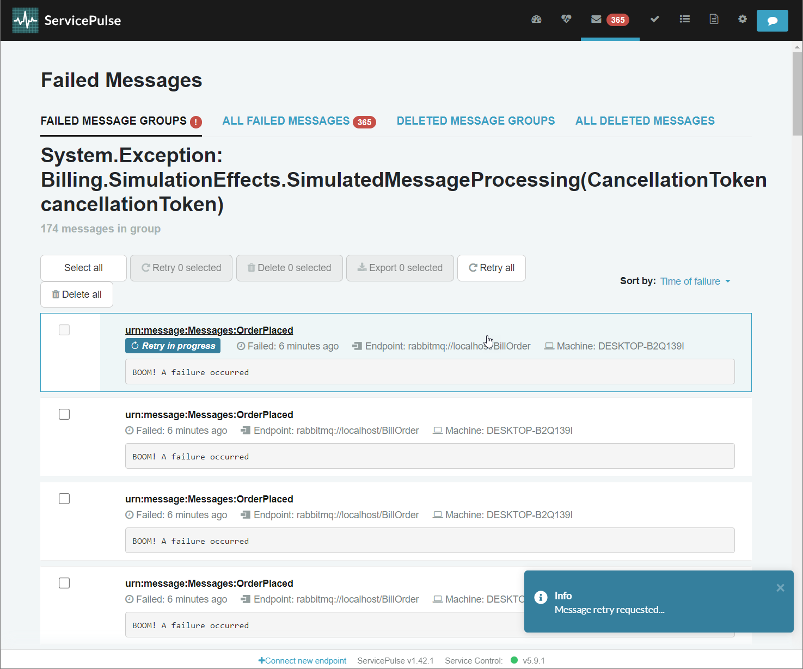
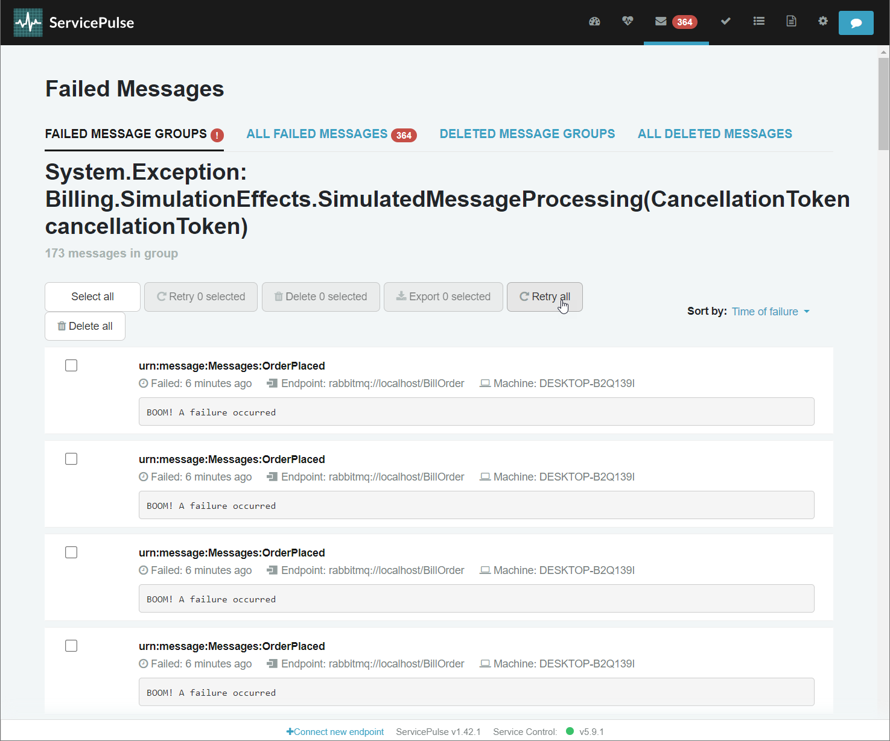
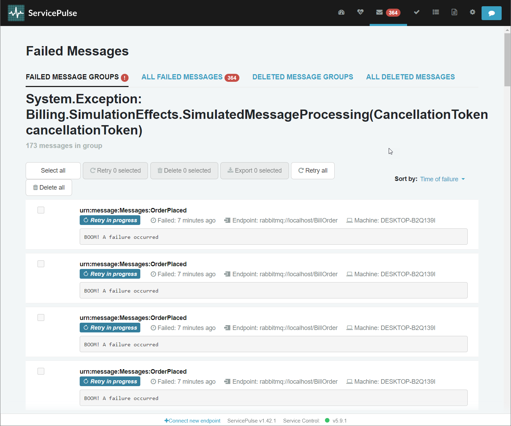

After resolving the issue that caused message processing failures, failed messages can be resent for reprocessing by the corresponding endpoint(s). This is referred to as a "retry" (or a manual retry, as opposed to the automated and configurable [recoverability](/nservicebus/recoverability/) process).

Manual retries of failed messages can be requested via the [Failed Messages page in ServicePulse](/servicepulse/intro-failed-messages.md).

A message that is sent for retry is marked as such and is not displayed in the failed message list or included in failed message groups unless reprocessing the message fails again.

ServiceControl keeps track of all retry attempts in the background. If a retry operation fails, ServicePulse will show the number of failed retry attempts.

If a message was retried and came back to ServiceControl as failed it might mean that this message is malformed and the receiver is not able to process it successfully no matter how many times it tries, for example, when the sending endpoint has a bug.

There are two ways to deal with this scenario. If the issue in the sender can be fixed, there will be no new malformed messages coming. The ones already sent can be redirected to an endpoint that specifically addresses the malformed messages. [This sample](/samples/servicecontrol/fix-messages/) shows how this can be done using the ServiceControl redirects feature.

If the sender cannot be fixed it is better to use a pipeline behavior to repair the messages at the receiver endpoint before they are passed to the handler. [This sample](/samples/pipeline/fix-messages-using-behavior/) demonstrates this scenario.

## ServicePulse interface

ServicePulse allows you to see failed messages and retry them. By default, the UI groups these messages based on the endpoint that failed to process them. You can see the source, and the number of failed messages.

### Retrying failed messages

The messages can be retried in different ways:
 - One by one
 - By the an entire group

#### 1. One by one

In this case, you will see the a notification showing that a retry has been been requested, and it is in progress.

#### 2. By the an entire group

You will see a retry in progress notification for all the messages, as well as the number of messages failed decreased.

